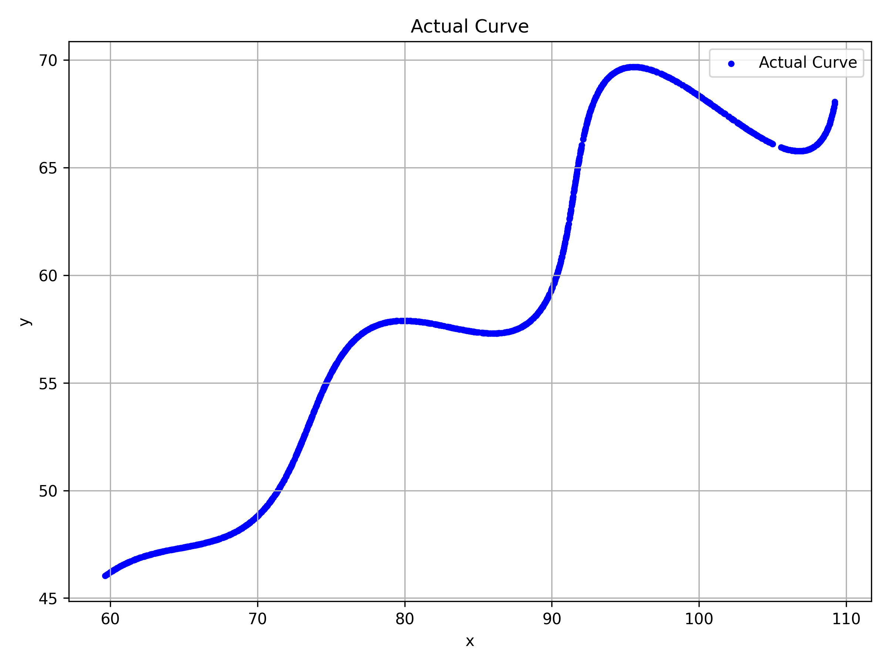
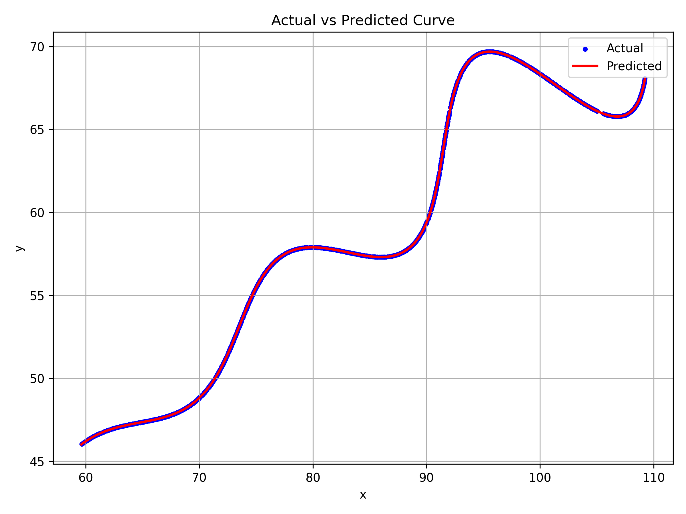

# AI Research & Development Assignment

## Parameter Estimation of a Parametric Curve

---
## Problem Statement

The objective of this assignment is to estimate the unknown parameters **θ (theta)**, **M**, and **X** of the given parametric equations using only the provided set of 2D points stored in `xy_data.csv`.

### Given Parametric Equations

```text
x = t*cos(θ) - exp(M*|t|)*sin(0.3*t)*sin(θ) + X

y = 42 + t*sin(θ) + exp(M*|t|)*sin(0.3*t)*cos(θ)
```

### Parameter Constraints

| Parameter | Range |
|-----------|-------|
| t | 6 ≤ t ≤ 60 |
| θ | 0° < θ < 50° |
| M | -0.05 < M < 0.05 |
| X | 0 < X < 100 |

The goal is to determine the values of **θ**, **M**, and **X** that best reconstruct the given curve.
---

# Approach

The solution follows a numerical optimization approach instead of machine learning since the problem is a parameter estimation task.

## Step 1: Load the Dataset

The provided `xy_data.csv` file is loaded using **Pandas**, and the x and y coordinates are extracted.

---

## Step 2: Generate the Parametric Curve

The given mathematical equations are implemented in Python.

The parameter **t** is uniformly sampled between **6 and 60** using 2000 points to generate a smooth approximation of the curve.

---

## Step 3: Define the Objective Function

The dataset points are not explicitly associated with their corresponding parameter **t** values.

Instead of comparing points by index, the generated curve is sampled densely and compared using the shortest distance between observed and predicted points.

A **KDTree (cKDTree)** is used to efficiently compute the nearest neighbour distance between the observed dataset and the generated curve.

The objective function is defined as the **mean nearest neighbour distance**, which is minimized during optimization.

---

## Step 4: Optimize Unknown Parameters

The unknown parameters

- θ
- M
- X

are optimized using **Differential Evolution** from SciPy.

The optimizer searches within the allowed parameter ranges:

| Parameter | Lower Bound | Upper Bound |
|------------|------------:|------------:|
| θ | 0° | 50° |
| M | -0.05 | 0.05 |
| X | 0 | 100 |

For every candidate solution:

1. Generate the corresponding parametric curve.
2. Compute the nearest neighbour distance using KDTree.
3. Calculate the mean error.
4. Update the parameters until convergence.

---

# Estimated Parameters

| Parameter | Estimated Value |
|-----------|----------------:|
| θ | **29.999993°** |
| θ (Radians) | **0.5235986496** |
| M | **0.0300000818** |
| X | **55.0001008561** |

Mean Nearest Neighbour Error:

```
0.0079552665
```

---

# Final Estimated Equation

### x-coordinate

```text
x = t*cos(0.5235986496)
    - exp(0.0300000818*|t|)
      *sin(0.3*t)
      *sin(0.5235986496)
    + 55.0001008561
```

### y-coordinate

```text
y = 42
    + t*sin(0.5235986496)
    + exp(0.0300000818*|t|)
      *sin(0.3*t)
      *cos(0.5235986496)
```

---

# Output

## Actual Curve



---

## Actual vs Predicted Curve



The optimized curve closely overlaps the provided dataset, indicating that the estimated parameters accurately reconstruct the original curve.

---
## Desmos Visualization

The recovered parametric curve can also be viewed on Desmos:

**Desmos Link:** https://www.desmos.com/calculator/geholcrizv


# Technologies Used

- Python 3
- NumPy
- Pandas
- SciPy
- Matplotlib

---

# Project Structure

```
AI-RD-Assignment/
│
├── estimate_parameters.py
├── xy_data.csv
├── actual_curve.png
├── actual_vs_predicted.png
├── requirements.txt
└── README.md
```

---

# Installation

```bash
pip install -r requirements.txt
```

---

# Running the Project

```bash
python estimate_parameters.py
```

The script will:

- Load the dataset
- Estimate θ, M and X
- Print the recovered parameters
- Generate the plots
- Save:

```
actual_curve.png
actual_vs_predicted.png
```

---

# Methodology Summary

1. Load the observed curve points.
2. Implement the parametric equations.
3. Uniformly sample the parameter **t**.
4. Construct a KDTree from the predicted curve.
5. Compute the mean nearest neighbour distance.
6. Optimize θ, M and X using Differential Evolution.
7. Generate the final curve using the optimized parameters.
8. Compare the predicted curve against the observed data.

---

# Conclusion

Using numerical optimization with Differential Evolution and KDTree-based nearest neighbour matching, the unknown parameters of the parametric curve were successfully recovered.

The recovered parameters satisfy the given constraints and produce a generated curve that closely matches the provided dataset with a very low mean error.
